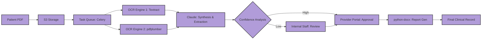

# Architecture — Medical Document Automation

## Detailed System Flow

## Components

- **Dual OCR Engine:** By using two different OCR technologies, the system minimizes the "hallucination" risk of single-engine extractions, especially for non-standard lab formats.
- **Claude (AWS Bedrock):** Acts as the medical reasoning engine, interpreting extracted text into structured clinical data points.
- **Confidence Gate:** A proprietary scoring algorithm that evaluates the agreement between OCR engines and the LLM's certainty.
- **Celery / Redis Queue:** Ensures that large batches of documents are processed reliably without timing out or losing state.
- **Provider Sign-off Portal:** A secure interface where clinicians review and electronically sign every report before it reaches the patient.

## Data Flow
1. **Ingestion:** Documents are uploaded to an encrypted S3 bucket.
2. **Parsing:** The dual-OCR system extracts raw text and table data.
3. **Reasoning:** Claude identifies key biomarkers and trends from the raw extraction.
4. **Validation:** The system checks if all required fields were extracted with high confidence.
5. **Finalization:** Upon clinician approval, a structured .docx file is generated for the patient record.

## Resilience & Compliance
- **Audit Trail:** Every stage of the 16-step process is recorded with a full traceability log.
- **Idempotency:** Processing tasks are designed to be idempotent, preventing duplicate extractions in case of network retries.
- **HIPAA-Ready:** Architecture follows strict data isolation and encryption standards suitable for healthcare environments.

## Confidentiality
Note that internal extraction prompts, specific clinical business logic, and database schemas are withheld.
