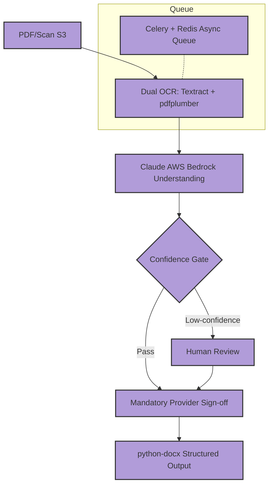
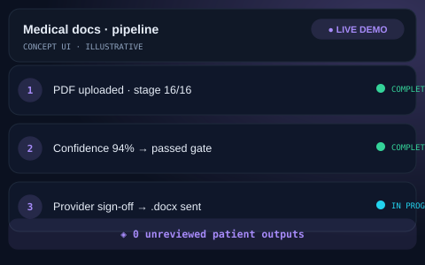

# 🏥 Longevity/Hormone Clinic — Medical Document Automation System

## The Problem
A longevity and hormone clinic was manually processing complex medical lab results and patient history PDFs. This manual process was not only slow but carried the inherent risk of human error when transcribing sensitive medical data into patient-facing reports, where accuracy is non-negotiable.

## The Solution
We developed a sophisticated 16-stage document processing pipeline that leverages dual-engine OCR and LLM intelligence. The system is designed with a "Safety-First" philosophy, where every patient-facing output is gated by a clinician's sign-off, ensuring total medical accuracy.

- **16-Stage Pipeline:** Comprehensive workflow from ingestion to final document generation.
- **Dual-Engine OCR:** Combines AWS Textract and pdfplumber for maximum extraction reliability.
- **Confidence Gating:** AI-driven flags identify uncertain extractions for mandatory human review.
- **Clinician Sign-off:** A hard gate ensuring zero unreviewed patient-facing outputs.
- **Async Reliability:** Powered by Celery and Redis to handle high-volume document queues.
- **Structured Output:** Automated generation of polished medical documents via python-docx.

## Architecture at a Glance

## Key Metrics
| Metric | Value |
| :--- | :--- |
| Pipeline Stages | 16 Distinct Steps |
| Unreviewed Outputs | 0 (By Design) |
| OCR Accuracy | Dual-Engine Redundancy |

## What Was Built
- [x] Full 16-stage document processing pipeline.
- [x] Dual OCR integration (Textract + pdfplumber).
- [x] Confidence-based gating logic for extraction quality.
- [x] Provider sign-off interface and workflow.
- [x] Async processing architecture using Celery/Redis.
- [x] Automated docx report generation engine.

## Deliberately Not Published
- [ ] 🔒 Clinical credentials and patient PHI.
- [ ] 🔒 Production API keys and AWS IAM roles.
- [ ] 🔒 Internal extraction prompts and rule-sets.

This repository is a portfolio presentation. No proprietary workflows, source code, or client data are published — by design.

## See It in Action

> Illustrative concept UI — a visual walkthrough of the workflow. Not a production screenshot.

## Tech Stack
- FastAPI
- Claude (AWS Bedrock)
- AWS Textract
- pdfplumber
- PostgreSQL / RDS
- Celery / Redis
- python-docx

---
[Architecture Deep-Dive](ARCHITECTURE.md) · [Case Study](CASE-STUDY.md)

**Built by MB Sabbir — AI Automation Engineer**  
*Production-grade automation, not templates*
