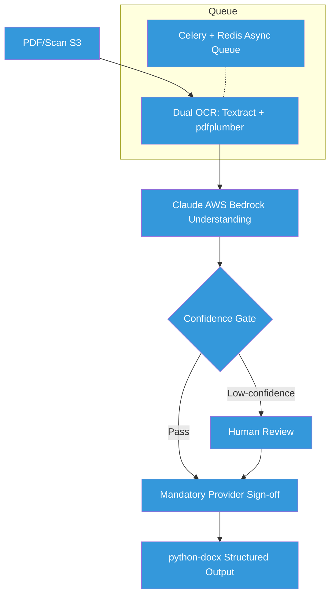

# Healthcare Clinics: Automate Document Processing Without Risk

 
 


**Client:** Longevity/Hormone Clinic | **Industry:** Healthcare | **Delivered by:** K MD SAYAD RAHMAN (Sayad.dev | AI Automation)

---

## Contents

- [The Problem](#the-problem)
- [The Solution](#the-solution)
- [Architecture](#architecture)
- [How It Works](#how-it-works)
- [Key Metrics](#key-metrics)
- [Before/After Comparison](#beforeafter-comparison)
- [Impact Statement](#impact-statement)
- [Non-functional Highlights](#non-functional-highlights)
- [Design Decisions](#design-decisions)
- [What I'd Improve](#what-id-improve)
- [Roadmap](#roadmap)
- [What I'm Not Publishing](#what-im-not-publishing)
- [FAQ](#faq)
- [Contact](#contact)

---

## The Problem

A longevity and hormone clinic was manually processing complex medical lab results and patient history PDFs. This manual process was not only slow but carried the inherent risk of human error when transcribing sensitive medical data into patient-facing reports, where accuracy is non-negotiable.

**In practical terms:**
- Manual PDF processing = **slow turnaround times**
- Human transcription risk = **potential medical errors**
- No systematic quality control = **inconsistent outputs**
- Labor-intensive process = **high operational costs**
- Patient data handling = **compliance concerns**

**The cost:** Risk of medical errors and slow patient service in a healthcare setting where accuracy is critical.

---

## The Solution

We developed a sophisticated 16-stage document processing pipeline that leverages dual-engine OCR and LLM intelligence. The system is designed with a "Safety-First" philosophy, where every patient-facing output is gated by a clinician's sign-off, ensuring total medical accuracy.

**Core capabilities:**
- **16-Stage Pipeline:** Comprehensive workflow from ingestion to final document generation
- **Dual-Engine OCR:** Combines AWS Textract and pdfplumber for maximum extraction reliability
- **Confidence Gating:** AI-driven flags identify uncertain extractions for mandatory human review
- **Clinician Sign-off:** A hard gate ensuring zero unreviewed patient-facing outputs
- **Async Reliability:** Powered by Celery and Redis to handle high-volume document queues
- **Structured Output:** Automated generation of polished medical documents via python-docx

---

## Architecture



**Data Flow:**
1. **Ingest:** Medical documents uploaded to S3 storage
2. **Extract:** Dual OCR engines process documents for reliability
3. **Understand:** Claude AI interprets medical content and context
4. **Gate:** Confidence scoring determines routing (auto vs manual review)
5. **Review:** Low-confidence extractions require clinician verification
6. **Approve:** Mandatory provider sign-off for all patient outputs
7. **Generate:** Final structured documents created via python-docx

---

## How It Works

### Step-by-Step Process:

1. **Document Ingestion:** Medical PDFs uploaded to secure S3 storage
2. **Dual OCR Processing:** AWS Textract and pdfplumber extract text in parallel
3. **AI Understanding:** Claude (AWS Bedrock) interprets medical context
4. **Confidence Scoring:** Each extraction assigned confidence score
5. **Intelligent Routing:** High-confidence → auto, low-confidence → manual review
6. **Clinician Sign-off:** Mandatory provider approval for all outputs
7. **Document Generation:** Structured medical reports created automatically
8. **Quality Audit:** Full audit trail for medical compliance

### Technology Stack:
- **Core Application:** FastAPI for API services
- **AI Integration:** Claude via AWS Bedrock for medical text understanding
- **OCR Engines:** AWS Textract + pdfplumber for dual-engine reliability
- **Database:** PostgreSQL / RDS for data persistence
- **Queue System:** Celery + Redis for async processing
- **Document Generation:** python-docx for structured output
- **Storage:** AWS S3 for secure document storage
- **System Type:** Healthcare Document Automation Pipeline

---

## Key Metrics

| Metric | Value |
| :--- | :--- |
| Pipeline Stages | 16 Distinct Steps |
| Unreviewed Outputs | 0 (By Design) |
| OCR Accuracy | Dual-Engine Redundancy |
| Safety Gates | 2 (Confidence + Clinician) |

---

## Before/After Comparison

### BEFORE (Manual Processing - High Risk)
```
[Medical PDF Received] 
    ↓ (manual queue)
[Manual OCR/Transcription] 
    ↓ (human error risk)
[Manual Data Entry] 
    ↓ (inconsistent quality)
[Manual Review Process] 
    ↓ (ad-hoc checks)
[Patient Report Generation] 
    ↓
= **Slow, error-prone, inconsistent quality** ❌
```

### AFTER (Automated Pipeline - Safe)
```
[Medical PDF Received] 
    ↓ (automated ingestion)
[Dual OCR Processing] 
    ↓ (parallel engines)
[AI Understanding] 
    ↓ (Claude medical context)
[Confidence Gating] 
    ↓ (intelligent routing)
[Clinician Sign-off] 
    ↓ (mandatory approval)
[Automated Generation] 
    ↓
= **Fast, accurate, consistent quality with safety gates** ✅
```

**The difference:** Automated processing with mandatory human oversight for medical accuracy.

---

## Impact Statement

**Business Value Delivered:**
- **Zero unreviewed outputs** by design (safety-first architecture)
- **Dual-engine reliability** ensures maximum extraction accuracy
- **16-stage pipeline** provides comprehensive quality control
- **Clinician control** maintained through mandatory sign-off gates
- **Async processing** handles high-volume document queues efficiently

**Client ROI:** Risk-free medical document automation that maintains clinical oversight while dramatically improving efficiency.

---

## Non-functional Highlights

**Reliability & Error Handling:**
- **Dual-Engine OCR:** Redundancy ensures maximum extraction reliability
- **Confidence Gating:** AI-driven quality control before human review
- **Mandatory Sign-off:** Zero unreviewed patient-facing outputs
- **Audit Trails:** Full logging for medical compliance and traceability
- **Async Processing:** Celery + Redis handles high-volume queues reliably
- **Production-Grade Safety:** Built for healthcare where accuracy is non-negotiable

**Performance:**
- **Parallel OCR processing** reduces extraction time
- **Async queue system** handles high document volumes
- **Scalable architecture** for clinic growth

**Safety:**
- **Human-in-the-Loop:** Clinician approval required for all outputs
- **Confidence Scoring:** Automatic identification of uncertain extractions
- **Medical Compliance:** Full audit trail for regulatory requirements

---

## Design Decisions

**Why This Architecture:**
- **Dual-Engine OCR:** Combines AWS Textract (industry standard) + pdfplumber (flexible)
- **Claude AI:** Superior medical text understanding vs generic models
- **16-Stage Pipeline:** Comprehensive quality control for medical accuracy
- **Mandatory Sign-off:** Clinician control maintained despite automation
- **Async Processing:** Handles high-volume medical document queues

**Trade-offs:**
- **Safety vs Speed:** Mandatory clinician sign-off ensures accuracy over speed
- **Complexity vs Reliability:** 16-stage pipeline ensures quality but adds complexity
- **Cost vs Accuracy:** Dual OCR increases cost but maximizes reliability

---

## What I'd Improve

With more time/budget:
- **Specialized Medical Models:** Fine-tune models for specific medical domains
- **Advanced Analytics:** Track extraction accuracy over time
- **Integration Expansion:** EHR system integration for seamless workflow
- **Mobile Interface:** Mobile app for clinician review and approval
- **Voice Annotations:** Dictation support for clinician notes

---

## Roadmap

- [ ] **v2.0:** EHR system integration for seamless workflow
- [ ] **Mobile App:** Mobile interface for clinician review
- [ ] **Advanced Analytics:** Extraction accuracy tracking and improvement
- [ ] **Specialized Models:** Domain-specific medical AI models
- [ ] **Voice Support:** Dictation for clinician annotations

---

## What I'm Not Publishing

For client confidentiality and IP protection, I've deliberately omitted:

- Clinical credentials and patient PHI
- Production API keys and AWS IAM roles
- Internal extraction prompts and rule-sets
- Specific medical document templates
- Proprietary confidence scoring algorithms
- Integration authentication details

**This is a real client system for a healthcare clinic. Medical confidentiality applies.**

---

## FAQ

**Q: How do you ensure medical accuracy with automation?**  
A: Every patient-facing output requires mandatory clinician sign-off; zero unreviewed outputs.

**Q: Why dual OCR engines?**  
A: AWS Textract + pdfplumber provide redundancy for maximum extraction reliability.

**Q: Is this HIPAA compliant?**  
A: Built with healthcare compliance in mind, though specific compliance depends on implementation.

**Q: Can this handle high document volumes?**  
A: Yes, Celery + Redis async queue handles high-volume processing efficiently.

---

## Contact

**K MD SAYAD RAHMAN** - Sayad.dev | AI Automation

**📧 Work Email:** khandokarsayad@gmail.com  
**📧 Personal Email:** mdsadrhoman123@gmail.com  
**💼 LinkedIn:** https://linkedin.com/in/khandokarsabbir  
**🐙 GitHub:** https://github.com/mdsadrhoman123-stack

**🚀 Open to Work - Accepting New Automation Projects**

**📩 Email me with your automation challenge - I'll tell you exactly 
which part I'd automate first, and which part I wouldn't.**

---

## See My Other Automation Systems

- [Real Estate AI Automation](../distressed-property-detection) - Property deal detection
- [M&A Deal-Flow Automation](../edugrow-ma-platform) - M&A advisory systems
- [Solar CRM Automation](../irish-solar-crm) - Field service business systems
- [E-commerce Review Automation](../review-outreach-pipeline) - Customer review generation

---

<div align="center">

**Built by K MD SAYAD RAHMAN (Sayad.dev | AI Automation)**

**📧 Contact:** khandokarsayad@gmail.com | mdsadrhoman123@gmail.com

Copyright (c) 2024 K MD SAYAD RAHMAN. All rights reserved. Portfolio use only.

*[n8n](https://n8n.io) | [Claude AI](https://claude.ai) | [Healthcare Automation](https://linkedin.com/in/khandokarsabbir)*

</div>