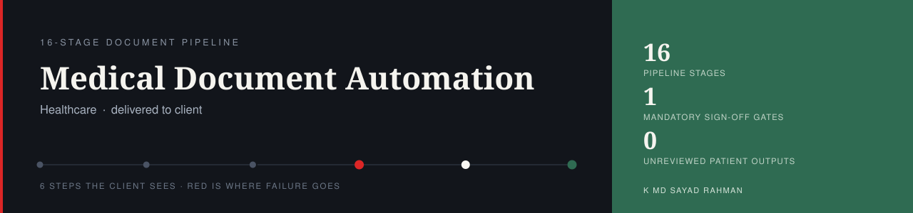
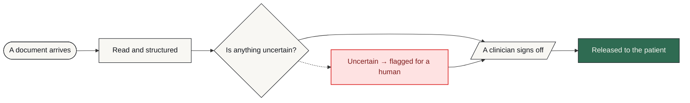

# Medical Document Automation

**Documents are read, structured and drafted automatically — and nothing reaches a patient without a clinician signing off.**

   

| | |
| :--- | :--- |
| **Built for** | Longevity / hormone-optimization clinic (US) |
| **Industry** | Healthcare |
| **Status** | delivered to client |
| **Role** | Designed, built and deployed end to end |

---

### On this page

[The problem](#the-problem) · [What changed](#what-changed) · [How it works](#how-it-works) · [When it breaks](#when-it-breaks) · [The stack](#the-stack) · [Limitations](#honest-limitations) · [Read deeper](#read-deeper)

---

## The problem

A longevity and hormone-optimization clinic needed the document work behind patient care automated, without introducing the risk of an AI-generated error reaching a patient unreviewed.

In a medical context that is not an acceptable trade for speed. The constraint came first and the design followed it.

## What changed

| | Before | After |
| :--- | :--- | :--- |
| **Document turnaround** | Clinician hours of data entry | Automated draft, clinician reviews |
| **Uncertain extraction** | Indistinguishable from certain | Flagged by a confidence gate |
| **Patient-facing output** | Whatever was typed | Nothing without provider sign-off |
| **Where data sits** | Ad hoc | Client's own AWS account |
| **Failed processing** | Silently missing | Queued and retried, or alerted |

Before/after describes the change in process, not benchmarked throughput. Where a number is not measured, it is not claimed.

## How it works

A 16-stage pipeline extracts text from PDFs and scans, structures it with an AI provider call, gates anything uncertain by confidence, and holds every output behind a mandatory provider sign-off before it can reach a patient.

<table>
<tr>
<td width="42" valign="top" align="center"><b>01</b></td><td valign="top"><b>A document arrives</b> A PDF or a scan enters the pipeline. No one retypes anything.</td>
</tr>
<tr>
<td width="42" valign="top" align="center"><b>02</b></td><td valign="top"><b>Text is pulled out</b> Two extraction paths, because a clean PDF and a photographed scan are not the same problem.</td>
</tr>
<tr>
<td width="42" valign="top" align="center"><b>03</b></td><td valign="top"><b>Content is structured</b> The extracted text is organised into the fields the clinic actually uses.</td>
</tr>
<tr>
<td width="42" valign="top" align="center"><b>04</b></td><td valign="top"><b>Uncertainty is marked</b> A confidence gate separates what the system is sure about from what it is not. This is the whole design.</td>
</tr>
<tr>
<td width="42" valign="top" align="center"><b>05</b></td><td valign="top"><b>A clinician signs off</b> Mandatory. The system prepares; a person releases.</td>
</tr>
<tr>
<td width="42" valign="top" align="center"><b>06</b></td><td valign="top"><b>Then the patient sees it</b> And the record of who signed off is kept.</td>
</tr>
</table>

### How it flows

What happens to the client's work, in the order they experience it. The internal build — node graph, execution order, prompts, thresholds — is deliberately not published.

<b>What the shapes mean</b> — colour is not the only signal

| Shape | Means |
| :--- | :--- |
| **rounded** | Where the client's process starts |
| **box** | Something the system does |
| **diamond** | A decision point |
| **slanted** | A person has to act |
| **green box** | The good outcome |
| **red box** | Failure path — held, escalated or alerted |

Red appears in exactly one role across every repo in this portfolio: where failure goes. Nowhere else. If you see red, something is being held, escalated or alerted.

> **Walk it interactively** — [open the demo](https://mdsadrhoman123-stack.github.io/medical-document-automation/) and press **Break it** to watch the failure path light up. Source: [`docs/index.html`](docs/index.html)

## When it breaks

Most automation portfolios show you the happy path. The happy path is the easy half. This is the half that decides whether a system survives contact with a real business.

| What goes wrong | How it is detected | What the system does | Who finds out |
| :--- | :--- | :--- | :--- |
| **Extraction confidence is low** | Confidence gate | Flagged and routed to a human rather than passed on | Provider sees it flagged |
| **Scan is unreadable** | Extraction returns nothing usable | Held for manual handling, no partial output generated | Alert with the document reference |
| **AI provider call fails** | API error | Retried; the document stays queued rather than skipped | Alert if retries exhaust |
| **Worker dies mid-document** | Async queue | Task is retried from its record, not lost | Nobody if it recovers |
| **Output looks wrong to the clinician** | Sign-off gate | Rejected — nothing reaches the patient | The clinician decides |
| **Anything unanticipated** | Error handling on every stage | Halt before release, keep the record | Alert with the document reference |

The default on an unhandled condition is to **stop and tell someone** — never to continue on a guess. A silent success is the failure mode that costs the most, because nobody goes looking for it.

## The stack

| Component | Why this one |
| :--- | :--- |
| **FastAPI** | Service layer for the pipeline |
| **Claude via AWS Bedrock** | Document structuring inside the client's AWS account |
| **Textract** | Extraction from scans |
| **pdfplumber** | Extraction from text-layer PDFs |
| **python-docx** | Generates the structured output document |
| **PostgreSQL on RDS** | Managed, backed-up record store |
| **Celery / Redis** | Async processing that survives a restart |
| **S3** | File storage |

### Counted, not estimated

| | |
| :--- | :--- |
| Pipeline stages | **16** |
| Mandatory sign-off gates | **1** |
| Unreviewed patient outputs | **0** |

These are counts from the built system — nodes, stages, versions, gates. No efficiency percentages are published here without a stated measurement method.

## Honest limitations

Every design decision costs something. These are the trade-offs in this build, stated by the person who made them.

- The sign-off gate is intentionally a bottleneck. Throughput is bounded by clinician review time, which is the correct trade in a medical setting.
- The confidence gate reduces the chance of an unnoticed error; it does not eliminate it. That is why sign-off is mandatory rather than conditional.
- Reference handling is specific to this clinic's protocols. Another practice would need its own configuration, not a copy.

## What is not in this repo

- **Client data.** None, in any form. Not anonymised, not sampled.
- **Credentials and endpoints.** Never committed. See [`NOTICE.md`](NOTICE.md).
- **The workflow itself.** No exports, no node graph, no execution order, no prompts, no scoring thresholds, no integration wiring — not sanitised, not partial, not in a screenshot. That is the build, and the build belongs to the engagement that paid for it.

This repository documents *how the problem was thought about* — the failure paths, the trade-offs, the reasoning. That is what tells you whether to hire someone. A copy of the wiring would not.

This is a portfolio repository documenting delivered work. It is not a product you can clone and run against your own accounts.

## Read deeper

| | |
| :--- | :--- |
| [01 · The problem](docs/01-problem.md) | The situation before, in full |
| [02 · The client journey](docs/02-journey.md) | Step by step, from their side |
| [03 · Architecture](docs/03-architecture.md) | Diagrams and the reasoning |
| [04 · Failure handling](docs/04-failure-handling.md) | Every path, and where it lands |
| [05 · The stack](docs/05-stack.md) | What was chosen and what was rejected |
| [06 · Results](docs/06-results.md) | What is measured and what is not |
| [07 · Limitations](docs/07-limitations.md) | The trade-offs, in detail |

---

### Tell me what the process is

I will tell you honestly whether automating it is worth your money — including when the answer is no.

**K MD SAYAD RAHMAN** — AI Automation Engineer  
n8n · AI agents · production reliability  
[khandokarsayad@gmail.com](mailto:khandokarsayad@gmail.com) · [mdsadrhoman123@gmail.com](mailto:mdsadrhoman123@gmail.com) · [LinkedIn](https://www.linkedin.com/in/khandokarsayad) · [More systems](https://github.com/mdsadrhoman123-stack)

