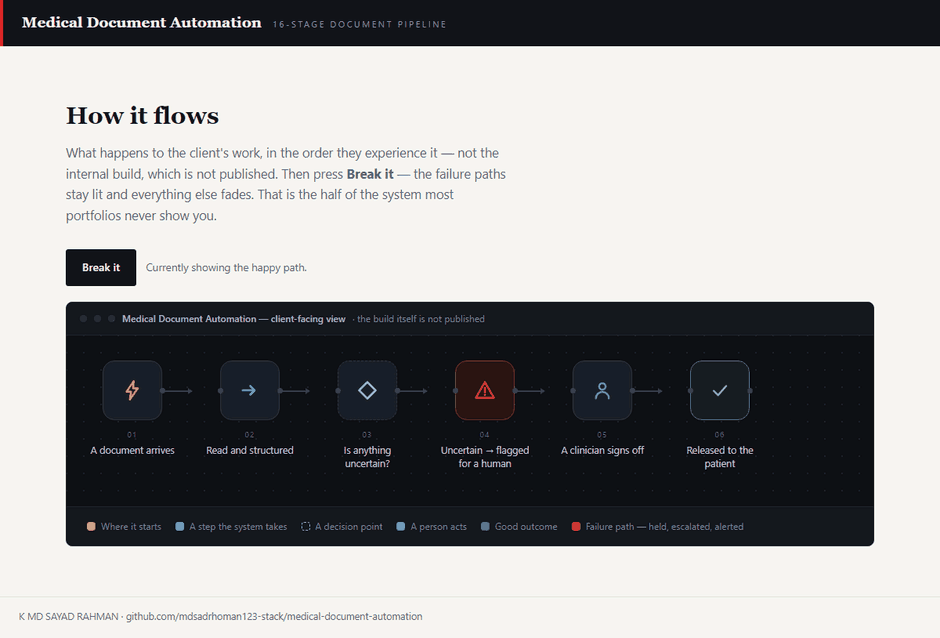

# Medical Document Automation

**Documents are read, structured and drafted automatically — and nothing reaches a patient without a clinician signing off.**

     [](https://github.com/mdsadrhoman123-stack/medical-document-automation/actions/workflows/honesty-check.yml)



**The system in five seconds, then the same system failing on purpose.** The second half is the half most portfolios leave out. That is a recording of [`docs/index.html`](docs/index.html) in this repository — one file, no build step, no network — with the **Break it** button actually pressed, not illustrated.

> [!NOTE]
> **What this is.** A production-grade system built to a brief that businesses in this sector post publicly, in their own words — the problem exactly as they stated it, not one invented to demonstrate something. It was engineered the way anything a business actually depends on has to be: the failure paths designed before the features, every one of them logged and alerted rather than left to chance. It runs on my own infrastructure. It is ready to deploy for any business with this problem, and it has not been sold or deployed into a customer's business yet.

| | |
| :--- | :--- |
| **Built for** | Longevity / hormone-optimization clinics (US) |
| **The brief** | The problem exactly as businesses in this sector post it — public job briefs on Upwork and Fiverr, in their words, not my framing |
| **Industry** | Healthcare |
| **Status** | running in my own environment |
| **Failure paths designed** | 6 — each with how it is detected, what the system does about it, and who finds out |
| **My role** | Sole engineer — scoping, architecture, build, failure design and operation |
| **Availability** | Ready to deploy for any business with this problem — built once as a product, not as a one-off. Running on my own infrastructure; not sold yet. |

---

### On this page

[The problem](#the-problem) · [What changed](#what-changed) · [How it works](#how-it-works) · [The shape of it](#the-shape-of-the-system) · [When it breaks](#when-it-breaks) · [Why this way](#why-it-is-built-this-way) · [Limitations](#honest-limitations) · [What is here](#what-is-in-this-repository) · [Read deeper](#read-deeper)

---

## The problem

A longevity and hormone-optimization clinic needed the document work behind patient care automated, without introducing the risk of an AI-generated error reaching a patient unreviewed.

In a medical context that is not an acceptable trade for speed. The constraint came first and the design followed it.

## What changed

| | Before | After |
| :--- | :--- | :--- |
| **Document turnaround** | Clinician hours of data entry | Automated draft, clinician reviews |
| **Uncertain extraction** | Indistinguishable from certain | Flagged by a confidence gate |
| **Patient-facing output** | Whatever was typed | Nothing without provider sign-off |
| **Where data sits** | Ad hoc | Client's own AWS account |
| **Failed processing** | Silently missing | Queued and retried, or alerted |

<sub>Before/after describes the change in process, not benchmarked throughput. Where a number is not measured, it is not claimed.</sub>

## How it works

A 16-stage pipeline extracts text from PDFs and scans, structures it with an AI provider call, gates anything uncertain by confidence, and holds every output behind a mandatory provider sign-off before it can reach a patient.

<table>
<tr>
<td width="42" valign="top" align="center"><b>01</b></td><td valign="top"><b>A document arrives</b><br>A PDF or a scan enters the pipeline. No one retypes anything.</td>
</tr>
<tr>
<td width="42" valign="top" align="center"><b>02</b></td><td valign="top"><b>Text is pulled out</b><br>Two extraction paths, because a clean PDF and a photographed scan are not the same problem.</td>
</tr>
<tr>
<td width="42" valign="top" align="center"><b>03</b></td><td valign="top"><b>Content is structured</b><br>The extracted text is organised into the fields the clinic actually uses.</td>
</tr>
<tr>
<td width="42" valign="top" align="center"><b>04</b></td><td valign="top"><b>Uncertainty is marked</b><br>A confidence gate separates what the system is sure about from what it is not. This is the whole design.</td>
</tr>
<tr>
<td width="42" valign="top" align="center"><b>05</b></td><td valign="top"><b>A clinician signs off</b><br>Mandatory. The system prepares; a person releases.</td>
</tr>
<tr>
<td width="42" valign="top" align="center"><b>06</b></td><td valign="top"><b>Then the patient sees it</b><br>And the record of who signed off is kept.</td>
</tr>
</table>

### How it flows

<sub>What happens to the client's work, in the order they experience it. The internal build — node graph, execution order, prompts, thresholds — is deliberately not published.</sub>


<details>
<summary><b>What the shapes mean</b> — colour is not the only signal</summary>

| Shape | Means |
| :--- | :--- |
| **rounded** | Where the client's process starts |
| **box** | Something the system does |
| **diamond** | A decision point |
| **slanted** | A person has to act |
| **green box** | The good outcome |
| **red box** | Failure path — held, escalated or alerted |

Red appears in exactly one role across every repo in this portfolio: where failure goes. Nowhere else. If you see red, something is being held, escalated or alerted.
</details>

> **Walk it interactively** — [`docs/index.html`](docs/index.html) is a single self-contained page. Download it, open it in any browser, and press **Break it** to watch the failure path light up. Nothing to install, no network calls.

## The shape of the system

Parts and the role each one plays. Not the wiring — no execution order, no prompt text, no thresholds. That is a deliberate line, and the last branch of the tree names exactly what sits on the other side of it.

```text
Medical Document Automation — the running system
│
├── Judgement ....................... where a decision or a piece of writing is made
│   └── Claude via AWS Bedrock ...... Document structuring inside the client's AWS account
│
├── Documents ....................... files becoming data, and data becoming files
│   ├── Textract .................... Extraction from scans
│   ├── pdfplumber .................. Extraction from text-layer PDFs
│   └── python-docx ................. Generates the structured output document
│
├── Memory .......................... what is remembered, and for how long
│   ├── PostgreSQL on RDS ........... Managed, backed-up record store
│   └── S3 .......................... File storage
│
├── Ground .......................... what the whole thing runs on
│   ├── FastAPI ..................... Service layer for the pipeline
│   └── Celery / Redis .............. Async processing that survives a restart
│
├── Failure design .................. 6 paths, designed before the features
│   ├── detected by ................. an error output, a timer, or a failed connection
│   ├── handled by .................. falling back, holding, or halting — never guessing
│   └── announced to ................ a named person, with the reason attached
│
└── Not in this repository .......... the part that would let you skip the thinking
    ├── the internal flow ........... which part runs after which, and on what condition
    ├── the prompts ................. wording, guardrails, the shape of the output
    ├── the thresholds .............. what counts as urgent, late, at capacity, a match
    └── the credentials ............. never committed, in any form, at any point
```

Read it as a set of decisions rather than a parts list. Every part is there because a specific failure or a specific constraint put it there, and the two sections below are the same story told twice: **When it breaks** is what each part is defending against, and **Honest limitations** is what it costs to have chosen that part and not another.

### Counted, not estimated

| | |
| :--- | :--- |
| Pipeline stages | **16** |
| Mandatory sign-off gates | **1** |
| Unreviewed patient outputs | **0** |

<sub>These are counts from the built system — nodes, stages, versions, gates. No efficiency percentages are published here without a stated measurement method.</sub>

## When it breaks

Most automation portfolios show you the happy path. The happy path is the easy half. This is the half that decides whether a system survives contact with a real business.

| What goes wrong | How it is detected | What the system does | Who finds out |
| :--- | :--- | :--- | :--- |
| **Extraction confidence is low** | Confidence gate | Flagged and routed to a human rather than passed on | Provider sees it flagged |
| **Scan is unreadable** | Extraction returns nothing usable | Held for manual handling, no partial output generated | Alert with the document reference |
| **AI provider call fails** | API error | Retried; the document stays queued rather than skipped | Alert if retries exhaust |
| **Worker dies mid-document** | Async queue | Task is retried from its record, not lost | Nobody if it recovers |
| **Output looks wrong to the clinician** | Sign-off gate | Rejected — nothing reaches the patient | The clinician decides |
| **Anything unanticipated** | Error handling on every stage | Halt before release, keep the record | Alert with the document reference |

The default on an unhandled condition is to **stop and tell someone** — never to continue on a guess. A silent success is the failure mode that costs the most, because nobody goes looking for it.

## Why it is built this way

Three decisions, each with the option that was turned down and the price of turning it down. A choice with no cost attached to it was not a choice — it was a default, and defaults are not worth reading about.

<details open>
<summary><b>Why sign-off is mandatory rather than conditional on confidence</b></summary>

**What it does.** Every output waits for a provider signature, no matter how confident the pipeline was about it.

**What was turned down.** Releasing automatically above a confidence score. That is where nearly all the throughput is — and a confidence gate only catches the errors it can see, and the dangerous ones in a clinical document are the confident ones.

**What that costs.** Throughput is bounded by clinician review time. In a medical setting that is the correct trade, and it means the system cannot be sold on speed.

</details>

<details>
<summary><b>Why there are two extractors instead of one</b></summary>

**What it does.** Text-layer PDFs go through pdfplumber; scans go to Textract. The document decides which.

**What was turned down.** OCR for everything. One path to maintain and one failure mode — and it re-recognises text that was already perfect, inventing errors in documents that had none.

**What that costs.** A routing decision before extraction, and two failure modes to design for rather than one.

</details>

<details>
<summary><b>Why the AI call runs inside the client's own AWS account</b></summary>

**What it does.** Document structuring goes through Bedrock in the client's account, so the documents never leave their boundary.

**What was turned down.** Calling the provider API directly. Simpler credentials and one less service to configure — and patient documents then cross into infrastructure the clinic has no agreement with.

**What that costs.** Tied to what Bedrock offers in that region. Reference handling is also specific to this clinic's protocols, so another practice needs its own configuration rather than a copy of this one.

</details>

Every cost above also appears in **Honest limitations** below. It is there twice on purpose: once as the reasoning, once as the consequence, so neither can be quietly dropped from the other.

## Honest limitations

Every design decision costs something. These are the trade-offs in this build, stated by the person who made them.

- The sign-off gate is intentionally a bottleneck. Throughput is bounded by clinician review time, which is the correct trade in a medical setting.
- The confidence gate reduces the chance of an unnoticed error; it does not eliminate it. That is why sign-off is mandatory rather than conditional.
- Reference handling is specific to this clinic's protocols. Another practice would need its own configuration, not a copy.

## What is in this repository

Every file, and the question it answers. Same layout in all eleven repositories in this portfolio, so the second one you open needs no orientation at all.

```text
medical-document-automation/
├── README.md ....................... ← you are here
├── SECURITY.md ..................... how to report something that should not be public
├── NOTICE.md ....................... what is withheld, and why
├── LICENSE ......................... covers the documentation, not a software grant
│
├── docs/ ........................... the long form — read in order or not at all
│   ├── index.html .................. the interactive demo, one file, no network
│   ├── 01-problem.md ............... the situation before, in full
│   ├── 02-journey.md ............... step by step, from their side
│   ├── 03-architecture.md .......... the diagrams, and why they are shaped that way
│   ├── 04-failure-handling.md ...... every failure path, and where it lands
│   ├── 05-stack.md ................. each choice, the option turned down, the cost
│   ├── 06-results.md ............... what is measured, and what is deliberately not
│   └── 07-limitations.md ........... the trade-offs, in detail
│
├── diagrams/ ....................... source, so the flow can be re-rendered
│   ├── pipeline-lr.mmd ............. the client-level flow, left to right
│   └── pipeline-tb.mmd ............. the same flow, top to bottom
│
├── assets/ ......................... local files only — nothing from a CDN
│   ├── banner.svg .................. the header on this page
│   ├── demo.gif .................... the recording at the top of this page
│   └── cta.svg ..................... the closing card
│
├── workflows/ ...................... empty on purpose — see below
│   └── README.md ................... why it is empty, in writing
│
└── .github/ ........................ the badge at the top of this page
    ├── honesty-check.py ............ the claim linter it runs
    └── workflows/
        └── honesty-check.yml ....... runs it on every push
```

There is no `src/` in that tree, and no `workflows/*.json`. That is not an omission — it is the design, and the next section says exactly what is being withheld and why.

## What is not in this repo

- **Data belonging to a real business.** None, in any form. Not anonymised, not sampled — there never was any.
- **Credentials and endpoints.** Never committed. See [`NOTICE.md`](NOTICE.md) for what is withheld, and [`SECURITY.md`](SECURITY.md) for how to report anything that slipped through.
- **The workflow itself.** No exports, no node graph, no execution order, no prompts, no scoring thresholds, no integration wiring — not sanitised, not partial, not in a screenshot. That is the build, and the build is not portfolio material.

This repository documents *how the problem was thought about* — the failure paths, the trade-offs, the reasoning. That is what tells you whether to hire someone. A copy of the wiring would not.

This is a portfolio repository documenting a system I designed and built. It is not a product you can clone and run against your own accounts.

## Read deeper

| | |
| :--- | :--- |
| [01 · The problem](docs/01-problem.md) | The situation before, in full |
| [02 · The journey](docs/02-journey.md) | Step by step, from their side |
| [03 · Architecture](docs/03-architecture.md) | Diagrams and the reasoning |
| [04 · Failure handling](docs/04-failure-handling.md) | Every path, and where it lands |
| [05 · The stack](docs/05-stack.md) | What was chosen and what was rejected |
| [06 · Results](docs/06-results.md) | What is measured and what is not |
| [07 · Limitations](docs/07-limitations.md) | The trade-offs, in detail |

---


### Tell me what the process is

I will tell you honestly whether automating it is worth your money — including when the answer is no.

**K MD SAYAD RAHMAN** — AI Automation Engineer  
n8n · AI agents · production reliability  
[khandokarsayad@gmail.com](mailto:khandokarsayad@gmail.com) · [mdsadrhoman123@gmail.com](mailto:mdsadrhoman123@gmail.com) · [LinkedIn](https://www.linkedin.com/in/khandokarsayad) · [More systems](https://github.com/mdsadrhoman123-stack)

